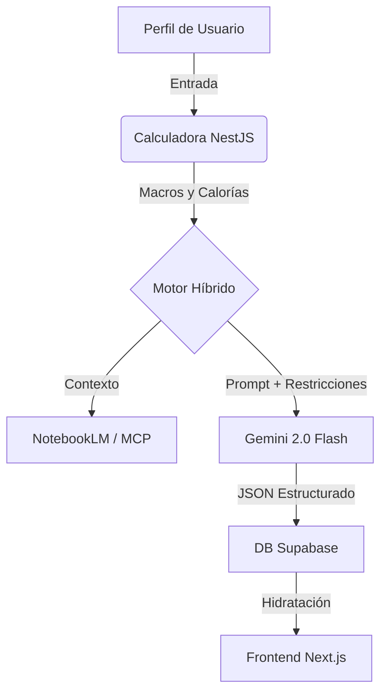

# 🏗️ Arquitectura de NutriFlow

> 🇬🇧 **[Read in English](./ARCHITECTURE.md)**

## 1. Visión General del Sistema

NutriFlow es un **monorepo de alto rendimiento** diseñado para escalabilidad y seguridad de tipos. Utiliza **Turborepo** para gestionar el entorno full-stack, asegurando eficiencia en los procesos de construcción y desarrollo.

### Estructura de Alto Nivel

```text
nutriflow/
├── apps/
│   ├── api/          # NestJS (Servicio Backend)
│   └── web/          # Next.js 16 (App Frontend)
├── packages/
│   ├── shared/       # DTOs, Tipos y Utilidades Compartidas
│   └── ui/           # (Futuro) Librería de UI/Lógica Compartida
├── infra/
│   └── supabase/     # Migraciones y Seeds de Base de Datos
└── docs/             # ADRs y Documentación Técnica
```

---

## 2. Diseño Backend (NestJS)

El backend (`apps/api`) sigue principios de **Clean Architecture**, separando responsabilidades en capas distintas:

-   **Controladores**: Manejan peticiones HTTP y validación (Zod/Class-Validator).
-   **Servicios**: Contienen la lógica de negocio.
-   **Repositorios**: Abstraen el acceso a datos (Supabase/Postgres).
-   **Módulos**: Organizan el código por dominio (ej., `Auth`, `Plans`, `DietEngine`).

### Tecnologías Clave
-   **Framework**: NestJS 11
-   **Lenguaje**: TypeScript (Modo Estricto)
-   **Integración IA**: Google Gemini 2.0 Flash vía Vertex AI / Google AI Studio.
-   **Inyección de Contexto**: **Model Context Protocol (MCP)** conecta el LLM con `NotebookLM` para contexto nutricional científicamente respaldado.

---

## 3. El Motor de Dieta "Híbrido"

La innovación central de NutriFlow es su **Motor de Dieta Híbrido**, que equilibra la precisión matemática con la creatividad generativa.

### Flujo de Trabajo

1.  **Capa Determinista (Matemáticas)**:
    -   Calcula **BMR** (ecuación Mifflin-St Jeor).
    -   Determina **TDEE** y divisiones de Macros basado en objetivos del usuario (ej., déficit para pérdida de peso).
    -   *¿Por qué?* Los LLMs son malos en matemáticas; el código es exacto.

2.  **Capa de Contexto (Conocimiento)**:
    -   Recupera guías nutricionales relevantes vía **MCP**.
    -   Filtra alérgenos y restricciones dietéticas (Restricciones Duras).

3.  **Capa Generativa (Creativa)**:
    -   **Gemini 2.0** recibe las restricciones calculadas y el contexto.
    -   Genera un plan de comidas JSON estructurado (Recetas, Combinaciones).



---

## 4. Arquitectura Frontend (Next.js)

El frontend (`apps/web`) está construido para velocidad y SEO.

-   **Framework**: Next.js 16 (App Router).
-   **Renderizado**: Server Components (RSC) para obtención de datos; Client Components para interactividad.
-   **Estilos**: **Tailwind CSS** + **Shadcn/UI** para un sistema de diseño premium y accesible.
-   **Estado**: Estado basado en URL para navegación, React Context para preferencias globales de usuario.

---

## 5. Datos y Seguridad (Supabase)

Usamos **Supabase** como un Backend-as-a-Service (BaaS) integral.

-   **Base de Datos**: PostgreSQL.
-   **Autenticación**: Supabase Auth (JWT).
-   **Seguridad**: **Row Level Security (RLS)** se aplica en TODAS las tablas.
    -   *Regla*: Los usuarios solo pueden acceder a sus propios datos (`auth.uid() = user_id`).
    -   *Excepción*: Roles de administrador para gestión de ingredientes.
