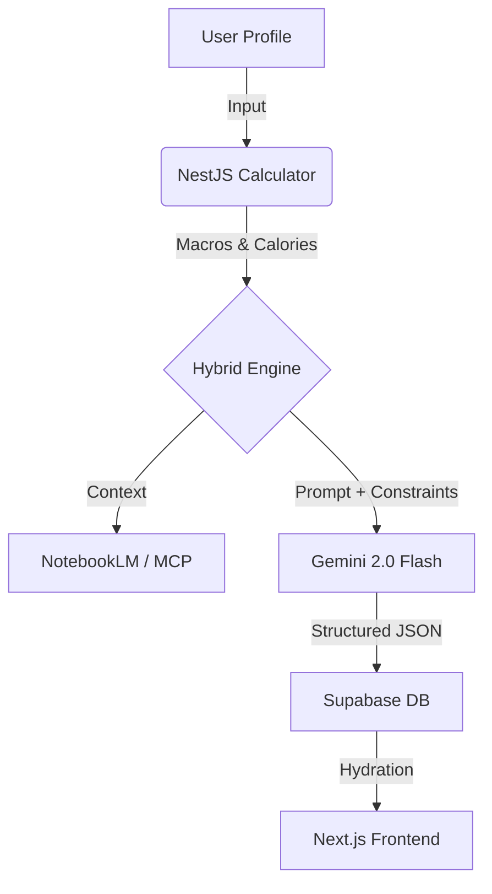

# 🏗️ NutriFlow Architecture

## 1. System Overview

NutriFlow is a **high-performance monorepo** designed for scalability and type safety. It utilizes **Turborepo** to manage the full-stack environment, ensuring efficiency in build and development processes.

### High-Level Structure

```text
nutriflow/
├── apps/
│   ├── api/          # NestJS (Backend Service)
│   └── web/          # Next.js 16 (Frontend App)
├── packages/
│   ├── shared/       # Shared DTOs, Types, and Utilities
│   └── ui/           # (Future) Shared Logic/UI Library
├── infra/
│   └── supabase/     # Database Migrations & Seeds
└── docs/             # ADRs and Technical Documentation
```

---

## 2. Backend Design (NestJS)

The backend (`apps/api`) follows **Clean Architecture** principles, separating concerns into distinct layers:

-   **Controllers**: Handle HTTP requests and validation (Zod/Class-Validator).
-   **Services**: Contain business logic.
-   **Repositories**: Abstract data access (Supabase/Postgres).
-   **Modules**: Organize code by domain (e.g., `Auth`, `Plans`, `DietEngine`).

### Key Technologies
-   **Framework**: NestJS 11
-   **Language**: TypeScript (Strict Mode)
-   **AI Integration**: Google Gemini 2.0 Flash via Vertex AI / Google AI Studio.
-   **Context Injection**: **Model Context Protocol (MCP)** connects the LLM with `NotebookLM` for scientifically backed nutritional context.

---

## 3. The "Hybrid" Diet Engine

The core innovation of NutriFlow is its **Hybrid Diet Engine**, which balances mathematical precision with generative creativity.

### Workflow

1.  **Deterministic Layer (Math)**:
    -   Calculates **BMR** (Mifflin-St Jeor equation).
    -   Determines **TDEE** and Macro splits based on user goals (e.g., deficit for weight loss).
    -   *Why?* LLMs are bad at math; code is exact.

2.  **Context Layer (Knowledge)**:
    -   Retrieves relevant nutritional guidelines via **MCP**.
    -   Filters allergens and dietary restrictions (Hard Constraints).

3.  **Generative Layer (Creative)**:
    -   **Gemini 2.0** receives the calculated constraints and context.
    -   Generates a structured JSON meal plan (Recipes, Combinations).



---

## 4. Frontend Architecture (Next.js)

The frontend (`apps/web`) is built for speed and SEO.

-   **Framework**: Next.js 16 (App Router).
-   **Rendering**: Server Components (RSC) for data fetching; Client Components for interactivity.
-   **Styling**: **Tailwind CSS** + **Shadcn/UI** for a premium, accessible design system.
-   **State**: URL-based state for navigation, React Context for global user preferences.

---

## 5. Data & Security (Supabase)

We use **Supabase** as a comprehensive Backend-as-a-Service (BaaS).

-   **Database**: PostgreSQL.
-   **Authentication**: Supabase Auth (JWT).
-   **Security**: **Row Level Security (RLS)** is enforced on ALL tables.
    -   *Rule*: Users can only access their own data (`auth.uid() = user_id`).
    -   *Exception*: Admin roles for ingredient management.
