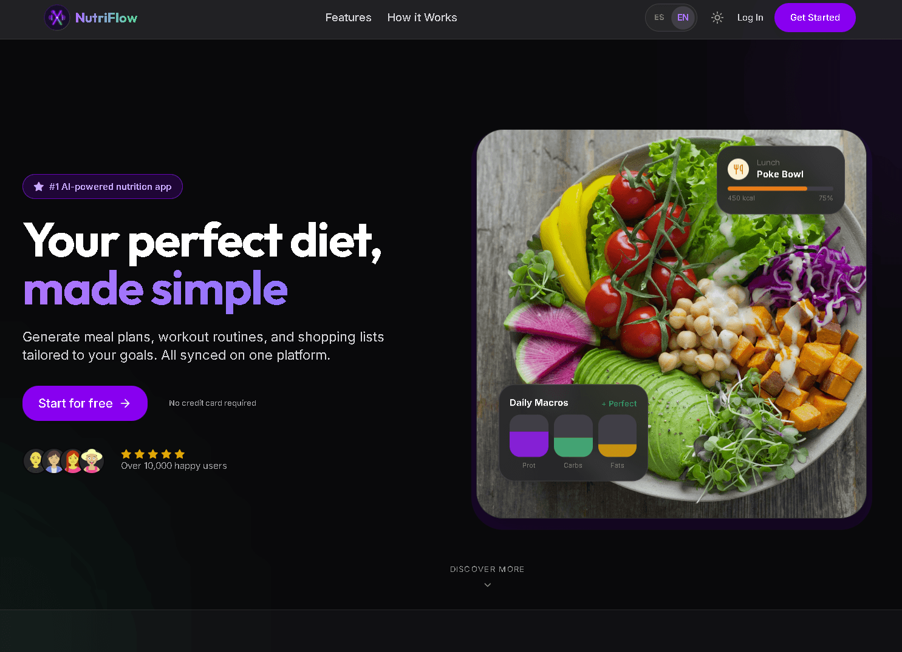
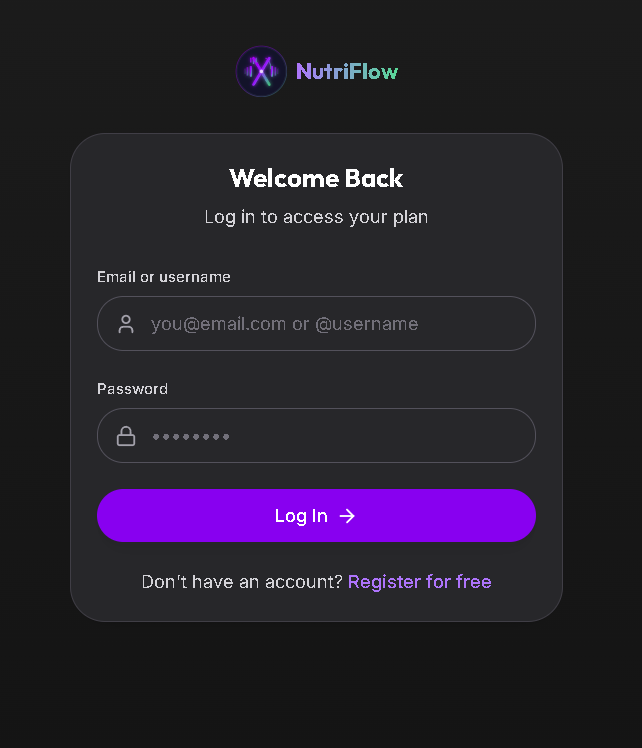
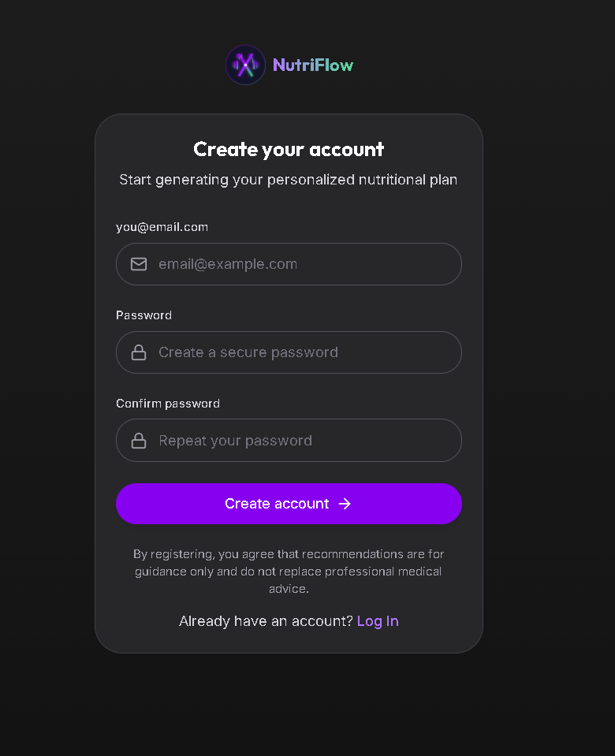
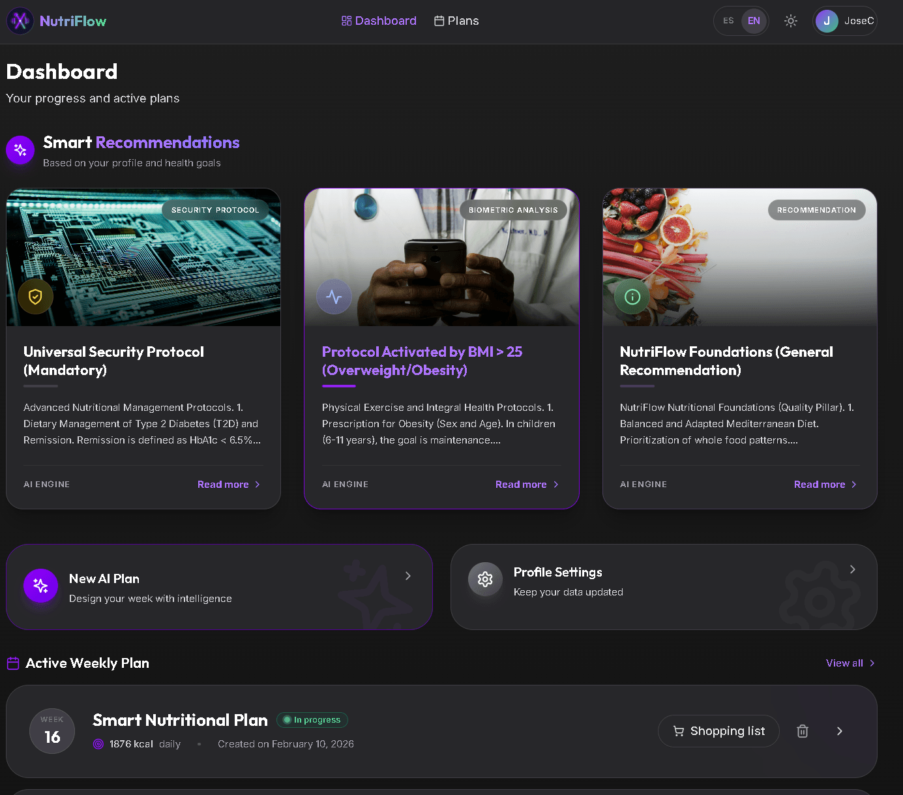
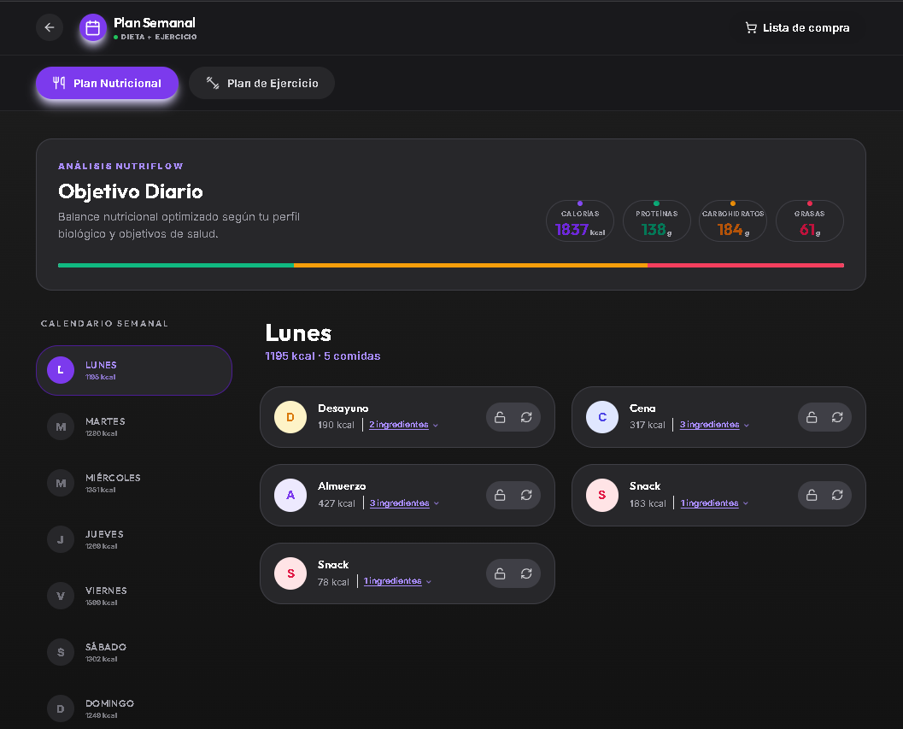
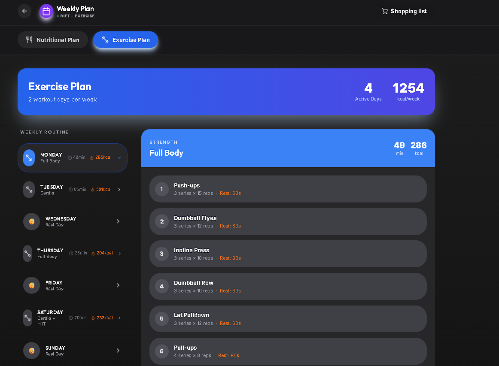

# 🍎 NutriFlow — Plataforma de Nutrición Personalizada Inteligente


> 🇺🇸 **[Read in English](./README.md)**

NutriFlow es una aplicación web full-stack de nivel producción centrada en la **planificación de nutrición personalizada**, diseñada para equilibrar la **precisión nutricional, la flexibilidad y la mantenibilidad** en una arquitectura de mundo real.

> **Estado:** 🚀 [Demo en Vivo Disponible](https://nutri-flow-mu.vercel.app/)  
> **Alcance:** Proyecto personal desarrollado y mantenido por un único desarrollador.

---

## Perspectiva del Proyecto

NutriFlow explora cómo combinar la **lógica nutricional determinista** con la **generación de contenido asistida por IA** de una manera controlada y verificable.  
El objetivo es evitar tanto los sistemas rígidos basados en plantillas como las salidas de IA descontroladas, manteniendo la arquitectura escalable y orientada a producción.

---

## El Problema

La mayoría de las aplicaciones de nutrición enfrentan limitaciones técnicas comunes:

- **Sistemas rígidos basados en reglas:** Son precisos pero difíciles de extender o personalizar profundamente.
- **Enfoques "AI-first":** Generan contenido atractivo pero suelen fallar al respetar restricciones nutricionales estrictas o reglas de seguridad de salud.
- **Acoplamiento fuerte:** La lógica de cálculo, la generación de contenido y la persistencia suelen estar mezcladas, dificultando la evolución o el testing del sistema.

---

## La Solución

NutriFlow separa las responsabilidades de forma clara en todo el stack tecnológico:

- **Capa de cálculo determinista:** Responsable de toda la matemática nutricional (TMB, GDT, distribución de macros) basada en modelos científicos (Mifflin-St Jeor).
- **Capa asistida por IA controlada:** Utilizada exclusivamente para la generación de contenido (recetas, sugerencias) dentro de restricciones predefinidas por la capa de cálculo.
- **Modelo de persistencia y seguridad:** Aplica el aislamiento de datos a nivel de base de datos, garantizando que la información sensible esté protegida por diseño.

Este enfoque prioriza la **corrección, la claridad y la testabilidad** sobre el prototipado rápido.

---

## Stack Tecnológico y Racional

| Capa | Tecnología | Racional |
|------|-----------|-----------|
| **Frontend** | [Next.js 16 (App Router)](https://nextjs.org/) | Permite Componentes de Servidor, reduce la complejidad en el cliente y mantiene la lógica sensible en el servidor. |
| **Backend** | [NestJS 11](https://nestjs.com/) | Proporciona un backend estructurado y modular con inyección de dependencias y una clara separación de responsabilidades. |
| **Base de Datos** | [PostgreSQL (Supabase)](https://supabase.com/) | Modelo relacional ideal para datos nutricionales estructurados y escalabilidad a largo plazo. |
| **Autenticación** | [Supabase Auth (JWT)](https://supabase.com/auth) | Autenticación basada en estándares con un boilerplate mínimo. |
| **IA Core** | [Gemini 2.0 Flash](https://deepmind.google/technologies/gemini/) | Motor híbrido de generación de contenido con salidas JSON estructuradas. |
| **Monorepo** | [Turborepo](https://turbo.build/) | Permite compartir DTOs y tipos de TypeScript entre frontend y backend, garantizando la consistencia del contrato. |
| **Testing** | [Vitest](https://vitest.dev/) & [Playwright](https://playwright.dev/) | Cubren tanto la lógica determinista como los flujos de usuario completos (E2E). |

---

## Arquitectura

El proyecto está organizado como un **monorepo** para mantener las responsabilidades aisladas compartiendo contratos donde es necesario:

```text
├── apps/
│   ├── web/    # Frontend en Next.js (App Router)
│   └── api/    # REST API en NestJS
└── packages/
    └── shared/ # DTOs compartidos, esquemas Zod y tipos de TypeScript
```
Para más detalles, consulta la [Visión General de la Arquitectura](./docs/architecture/overview.es.md).


### Decisiones Clave de Diseño

- **Contratos compartidos:** Los DTOs y esquemas se reutilizan en todo el stack para evitar discrepancias entre la API y el frontend.
- **Backend basado en servicios:** La lógica de negocio está aislada de la persistencia y de las integraciones externas.
- **Persistencia estructurada:** El contenido generado se almacena en tablas relacionales en lugar de texto libre para facilitar el análisis y la búsqueda.

---

## Seguridad y Autenticación

La autenticación se gestiona mediante **JWT (Supabase Auth)**.  
La autorización y el aislamiento de datos se aplican directamente en la capa de la base de datos.

### Seguridad a Nivel de Fila (Row Level Security - RLS)

Se utiliza RLS para garantizar el aislamiento total de los datos del usuario:

- Los usuarios solo pueden acceder a las filas donde su `auth.uid()` coincide con el `user_id` propietario.
- Los recursos anidados validan la propiedad mediante comprobaciones relacionales.
- Los datos de referencia compartidos (bases de datos nutricionales generales) están separados de la información de salud privada.

---

## Estrategia de Testing

- **Pruebas Unitarias (Vitest):**  
  Validan los cálculos nutricionales y la distribución de macros para prevenir regresiones en la lógica core.
- **Pruebas de Extremo a Extremo (Playwright):**  
  Cubren el flujo completo del usuario, desde el registro hasta la generación de planes y su persistencia.

El testing se centra en la corrección de las rutas críticas más que en una cobertura superficial de líneas de código.

---

## Flujo de Uso

### 1. Perfilado y Onboarding
Entrada de datos metabólicos, condiciones de salud y preferencias dietéticas.

<div align="center">
  
  <br/>
  <br/>
  
  
</div>

### 2. Panel Principal y Generación
Cálculos científicos combinados con generación de contenido por IA.

<div align="center">
  
</div>

### 3. Planes Semanales (Dieta y Ejercicio)
Planes de comidas automatizados de 7 días y listas de compras consolidadas.

<div align="center">
  
  <br/>
  <br/>
  
</div>


---

## Estado Actual y Roadmap

- [x] Arquitectura core y configuración de monorepo.
- [x] Autenticación y políticas de RLS.
- [x] Motor de cálculo nutricional determinista.
- [x] Cobertura de pruebas E2E para flujos principales.
- [x] Optimizaciones de rendimiento (caché de respuestas de IA).
- [ ] Exploración de cliente móvil utilizando la API existente.

---

## Rol y Responsabilidades

**Desarrollador Único**

- Diseño e implementación de la arquitectura full-stack.
- Desarrollo de servicios backend, UI del frontend y esquema de base de datos.
- Implementación de autenticación, políticas RLS y estrategia de testing.
- Gestión de despliegue, entornos y configuración de CI/CD.

---

## 🤝 Contribuyendo

¡Damos la bienvenida a las contribuciones! Por favor revisa nuestras **[Guías de Contribución](./CONTRIBUTING.es.md)** para estilo de código, proceso de PR y requisitos de testing.

---

## Optimizaciones de Rendimiento

### Frontend
- **Turbopack**: Habilitado (`--turbo`) para HMR y arranque más rápidos.
- **Transpilación**: Los paquetes compartidos se transpilan directamente para una integración fluida en el monorepo.

### Backend
- **Caché de Respuestas de IA**: Caché en memoria (TTL 24h) para planes de dieta generados, basado en el hash del perfil de usuario. Reduce costos de IA y latencia.

---

## Configuración de Entorno

- Duplica `apps/web/.env.example` (o el `/.env.example` raíz) como `.env.local` y rellena tus propios valores de Supabase antes de ejecutar comandos locales.
- Mantén fuera del control de versiones cualquier archivo que contenga `SUPABASE_URL`, `SUPABASE_ANON_KEY`, `SUPABASE_SERVICE_KEY`, `SUPABASE_JWT_SECRET`, `NEXT_PUBLIC_SUPABASE_URL` o `NEXT_PUBLIC_SUPABASE_ANON_KEY`; el repositorio solo guarda plantillas con marcadores de posición para que tus claves nunca se filtren.
- El frontend y el proxy requieren que `NEXT_PUBLIC_SUPABASE_URL` y `NEXT_PUBLIC_SUPABASE_ANON_KEY` estén disponibles en el momento de la compilación. Inyecta estas variables como secretos en tu CI (por ejemplo, GitHub Actions secrets en el bloque `env`) o configúralas localmente antes de ejecutar `pnpm build`. El script `apps/api/seed-user.ts` también espera que la clave de servicio (`SUPABASE_SERVICE_KEY` o `SUPABASE_SERVICE_ROLE_KEY`) esté definida de forma segura.

## 📄 Licencia

Distribuido bajo la Licencia MIT. Ver `LICENSE` para más información.

