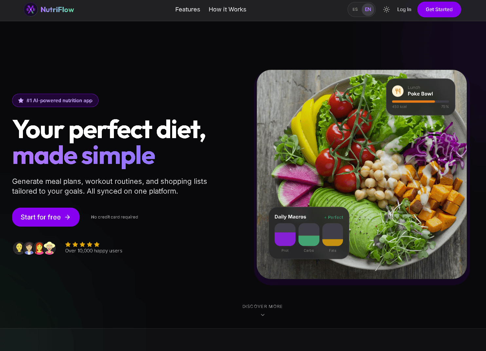
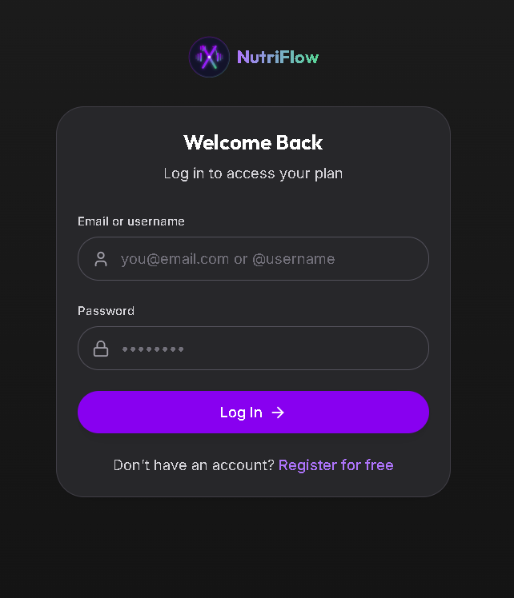
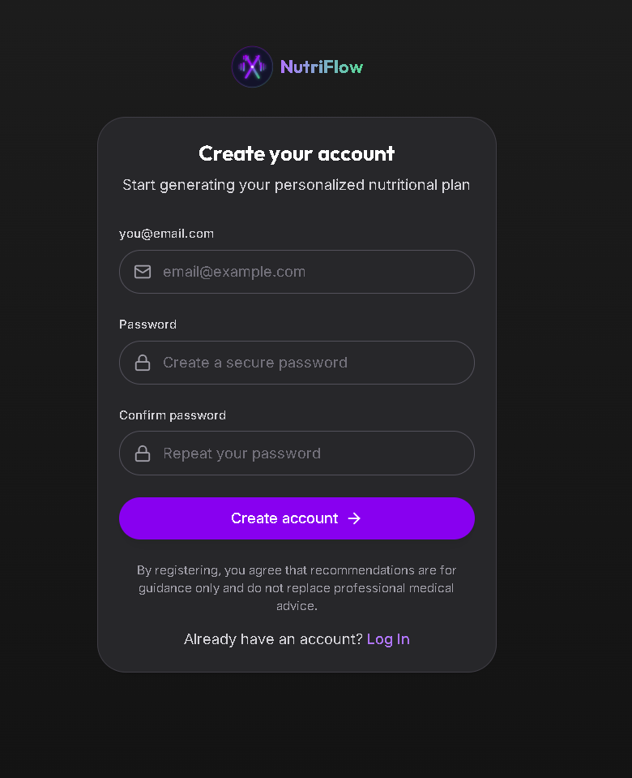
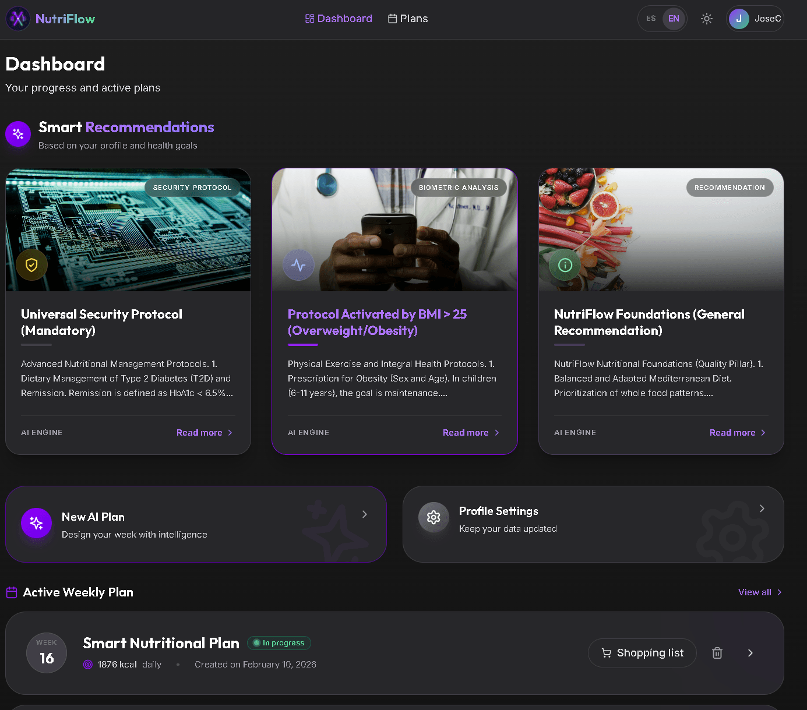
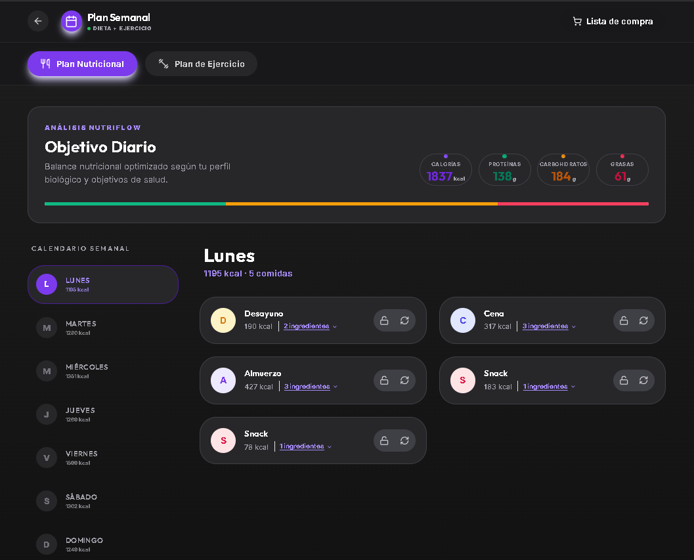
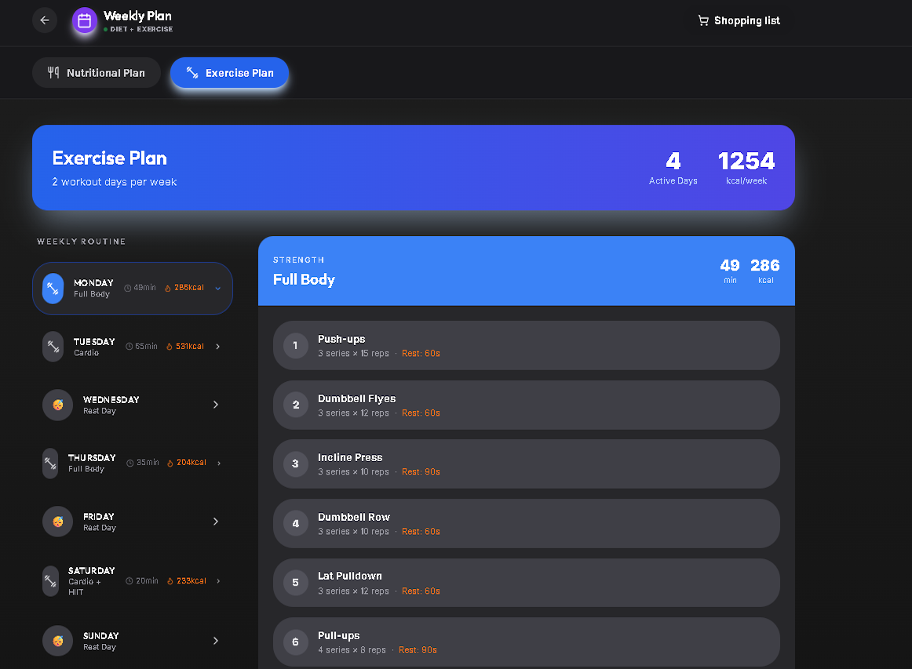

# 🍎 NutriFlow — Intelligent Personalized Nutrition Platform


> 🇪🇸 **[Leer en Español](./README.es.md)**

NutriFlow is a production-grade, full-stack web application focused on **personalized nutrition planning**, designed to balance **nutritional precision, flexibility, and maintainability** within a real-world architecture.

> **Status:** 🚀 [Live Demo Available](https://nutri-flow-mu.vercel.app/)  
> **Scope:** Personal project developed and maintained by a single developer

---

## Project Overview

NutriFlow explores how to bridge **deterministic nutritional logic** with **AI-assisted content generation** in a controlled and testable manner.  
The objective is to move beyond both rigid template-based systems and unpredictable AI hallucinations, while maintaining a scalable and production-oriented architecture.

---

## The Problem

Most nutrition applications suffer from common technical constraints:

- **Rigid Rule-Based Systems:** These are mathematically accurate but extremely difficult to extend or deeply personalize.
- **AI-First Approaches:** These generate appealing content but often fail to respect strict nutritional constraints or critical health safety rules.
- **Tight Coupling:** Calculation logic, content generation, and persistence layers are often mixed, making the system difficult to evolve or test reliably.

---

## The Solution

NutriFlow enforces a strict separation of concerns across the entire technology stack:

- **Deterministic Calculation Layer:** Handles all nutritional mathematics (BMR, TDEE, Macro distribution) based on established scientific models (Mifflin-St Jeor).
- **Controlled AI Layer:** Utilized exclusively for creative content generation (recipes, suggestions) within strict constraints predefined by the calculation layer.
- **Persistence & Security Model:** Enforces granular data isolation at the database level, ensuring sensitive health information is protected by design.

This architecture prioritizes **correctness, clarity, and testability** over rapid prototyping.

---

## Architecture & Tech Stack

The project is organized as a **Monorepo** managed by [Turborepo](https://turbo.build/), designed for scale and developer experience.

| Layer | Technology | Rationale / Highlights |
| :--- | :--- | :--- |
| **Frontend** | [Next.js 16 (App Router)](https://nextjs.org/) | Leverages Server Components, reduces client-side overhead, and keeps sensitive logic server-side. |
| **Backend** | [NestJS 11](https://nestjs.com/) | Provides a modular, structured architecture with Dependency Injection and clean separation of concerns. |
| **Database** | [PostgreSQL (Supabase)](https://supabase.com/) | Relational model ideal for structured nutritional data and long-term scalability. |
| **Auth** | [Supabase Auth (JWT)](https://supabase.com/auth) | Standards-compliant authentication with minimal custom boilerplate. |
| **AI Core** | [Gemini 2.0 Flash](https://deepmind.google/technologies/gemini/) | Hybrid generative engine delivering structured JSON outputs within predefined constraints. |
| **Shared** | [Turborepo](https://turbo.build/) | Ensures contract consistency by sharing DTOs, Zod schemas, and TypeScript types across the stack. |
| **Testing** | [Vitest](https://vitest.dev/) & [Playwright](https://playwright.dev/) | Comprehensive coverage for both deterministic logic and full-flow user journeys. |

---

## Architecture Design

Responsibilities are strictly isolated while sharing contracts where necessary:

```text
├── apps/
│   ├── web/    # Next.js Frontend (App Router)
│   └── api/    # NestJS REST API (Modular Architecture)
└── packages/
    └── shared/ # Shared DTOs, Zod schemas, and TypeScript types
```
For more details, see [Architecture Overview](./docs/architecture/overview.md) and the [Scaling Plan](./docs/architecture/scaling-plan.md).


### Key Design Decisions

- **Contract-Based Development:** Reusing DTOs and schemas across the stack prevents drift between the API and Frontend.
- **Service-Oriented Backend:** Business logic is isolated from persistence and external service integrations.
- **Structured Persistence:** Generated content is stored in relational tables rather than free-form text, enabling better analysis.

---

## Security & Authentication

Authentication is handled via **JWT (Supabase Auth)**.  
Authorization and data isolation are enforced directly at the database layer.

### Row Level Security (RLS)

RLS is leveraged to guarantee total user data isolation:

- Users can only access records where `auth.uid()` matches the owner `user_id`.
- Nested resources validate ownership through relational integrity checks.
- Shared reference data (nutritional databases) is logically separated from private health information.

---

## Testing Strategy

- **Unit Testing (Vitest):**  
  Validates caloric calculations and macro distributions to prevent regressions in core business logic.
- **E2E Testing (Playwright):**  
  Covers the entire user journey—from registration to plan generation and persistent storage.

Testing focuses on verifying correctness in critical paths rather than achieving superficial code coverage. See the [Testing Guide](./docs/guides/testing.md) for details.

---

## Usage Flow

### 1. User Profiling & Onboarding
Input of metabolic data, health conditions, and dietary preferences.

<div align="center">
  
  <br/>
  <br/>
  
  
</div>

### 2. Dashboard & Plan Generation
Scientific calculations matched with AI-driven content generation.

<div align="center">
  
</div>

### 3. Weekly Plans (Diet & Exercise)
Automated 7-day meal plans and consolidated shopping lists.

<div align="center">
  
  <br/>
  <br/>
  
</div>


---

## Current Status & Roadmap

- [x] Core architecture and monorepo foundation.
- [x] Global Authentication & RLS policies implementation.
- [x] Deterministic nutritional calculation engine.
- [x] Global Authentication & RLS policies implementation.
- [x] Deterministic nutritional calculation engine.
- [x] E2E test coverage for the primary user flow.
- [x] Performance optimizations (AI response caching).
- [ ] Mobile client exploration using the existing API.

---

## Performance Optimizations

### Frontend
- **Turbopack**: Enabled (`--turbo`) for faster HMR and startup.
- **Transpilation**: Shared packages are directly transpiled for seamless monorepo integration.

### Backend
- **AI Response Caching**: In-memory cache (24h TTL) for generated diet plans based on user profile hash. Reduces AI costs and latency.

---

## Role & Responsibilities

**Sole Developer**

- Architected and implemented the full-stack system from scratch.
- Developed backend services, frontend UI components, and the relational database schema.
- Integrated authentication, security policies (RLS), and the automated testing suite.
- Managed infrastructure deployment, development environments, and CI/CD pipelines.

---

## 🤝 Contributing

We welcome contributions! Please check out our **[Contributing Guidelines](./CONTRIBUTING.md)** for code style, PR process, and testing requirements.

---

## 📄 License

Distributed under the MIT License. See `LICENSE` for more information.
