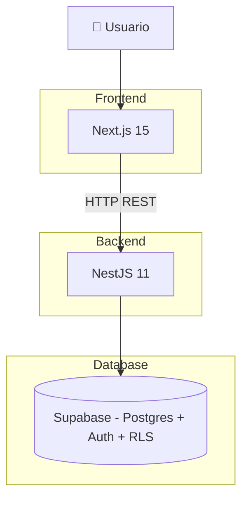

# NutriFlow — Arquitectura y Guía de Deploy

Este documento describe:

1. La estructura del monorepo
2. La arquitectura lógica del sistema
3. El modelo de separación Frontend / Backend
4. El plan de despliegue paso a paso
5. Checklist de producción

---

# 1️⃣ Estructura del Proyecto

```text
nutriflow/
├── apps/
│   ├── api/          # NestJS (Servicio Backend)
│   └── web/          # Next.js 16 (App Frontend)
├── packages/
│   ├── shared/       # DTOs, Tipos y Utilidades Compartidas
│   └── ui/           # (Futuro) Librería de UI/Lógica Compartida
├── infra/
│   └── supabase/     # Migraciones y Seeds de Base de Datos
└── docs/             # ADRs y Documentación Técnica
```

---

# 2️⃣ Principio Arquitectónico Clave

> Monorepo ≠ Monolito

Aunque todo vive en un único repositorio, **el frontend y el backend son aplicaciones independientes en runtime y despliegue**.

## Separación real

| Capa        | Runtime independiente | Dominio propio | Escalado independiente |
|------------|----------------------|----------------|------------------------|
| Frontend   | ✅                   | app.*         | ✅                     |
| Backend    | ✅                   | api.*         | ✅                     |
| Supabase   | ✅                   | cloud DB      | ✅                     |

---

# 3️⃣ Arquitectura General



---

# 4️⃣ Arquitectura Interna

## Backend (apps/api)
`api/src/`
├── `modules/`
│   ├── `auth/`
│   ├── `plans/`
│   └── `diet-engine/`
├── `controllers/`
├── `services/`
├── `repositories/`

### Flujo interno
`Controller` → `Service` → `Repository` → `Supabase`

| Capa | Responsabilidad |
| :--- | :--- |
| **Controller** | Validación (Zod), HTTP |
| **Service** | Lógica de negocio |
| **Repository** | Acceso a datos |
| **Modules** | Organización por dominio |

## Frontend (apps/web)
`web/src/`
├── `app/`           # App Router (pages/routes)
├── `components/`    # UI y lógica visual
├── `context/`       # Estado global
├── `lib/`           # Cliente API

### Flujo:
`UI` → `API Client` → `Backend`

> [!IMPORTANT]
> El frontend nunca ejecuta lógica de negocio crítica ni acceso directo a DB sensible.

---

# 5️⃣ Estrategia de Deploy
🎯 **Objetivo:** Separar completamente frontend y backend en infraestructura.

🌐 **Dominios recomendados:**
- `app.tudominio.com` → Frontend
- `api.tudominio.com` → Backend

---

# 6️⃣ Plan de Deploy Paso a Paso

### PASO 1 — Preparar Backend
1. **Health Check**
   Implementar `GET /health`. Debe devolver `200 OK`.
2. **Habilitar CORS estricto**
   Permitir únicamente `CORS_ORIGIN=https://app.tudominio.com`.
3. **Versionado obligatorio**
   Todos los endpoints deben vivir bajo `/v1/...`.  
   Ejemplo: `/v1/auth`, `/v1/plans`, `/v1/diet`.

### PASO 2 — Configurar Variables de Entorno
#### Backend
```env
NODE_ENV=production
PORT=3000
CORS_ORIGIN=https://app.tudominio.com
SUPABASE_URL=...
SUPABASE_ANON_KEY=...
SUPABASE_SERVICE_ROLE_KEY=...
```
> [!CAUTION]
> Nunca exponer claves de servicio (`SERVICE_ROLE_KEY`) al frontend.

#### Frontend
```env
NEXT_PUBLIC_API_BASE_URL=https://api.tudominio.com
```

### PASO 3 — Deploy del Backend
**Proveedor recomendado:** Railway
**Requisitos:**
- Build correcto del monorepo usando Turbo.
- Comando de Build: `pnpm install && pnpm turbo run build --filter=@nutriflow/api...`
- Comando de Start: `pnpm --filter @nutriflow/api start:prod`

**Checklist:**
- [ ] Servicio accesible en dominio `.railway.app`.
- [ ] `/v1/health` devuelve 200.
- [ ] Variables de entorno inyectadas.
- [ ] Watch paths configurados (`apps/api/**`, `packages/shared/**`).

### PASO 4 — Deploy del Frontend
**Proveedor recomendado:** Vercel
**Configuración:**
- Proyecto apuntando a `apps/web`.
- Variables de entorno configuradas.

**Checklist:**
- [ ] Web carga correctamente.
- [ ] Llamadas al backend funcionan.
- [ ] Login funciona.
- [ ] No hay llamadas directas a DB sensible.

---

# 7️⃣ Flujo Seguro de Autenticación
1. Usuario se autentica vía Supabase (frontend).
2. Frontend obtiene JWT.
3. Frontend envía JWT en: `Authorization: Bearer <token>`.
4. Backend valida JWT.
5. DB aplica RLS automáticamente.

---

# 8️⃣ Manejo de Procesos Pesados (Diet Engine)
Para procesos largos:
**Patrón recomendado:**
- `POST /v1/diet/plans` → `202 Accepted` + `jobId`
- `GET /v1/diet/jobs/:jobId`

**Estados:** `PENDING`, `RUNNING`, `READY`, `FAILED`.

Esto permite escalar fácilmente con workers en el futuro.

## 🔟 Resiliencia de IA (Knowledge Service)
El sistema utiliza una conexión perezosa (Lazy Load) para el servidor MCP:
- La API no depende del estado del servidor MCP para arrancar.
- El servidor MCP se conecta solo ante la primera solicitud.
- Si el motor de conocimiento falla, el sistema degrada la funcionalidad grácilmente sin afectar el flujo principal del usuario.

---

# 9️⃣ CI/CD en Monorepo
**Reglas recomendadas:**
- Cambios en `apps/web/**` → redeploy frontend
- Cambios en `apps/api/**` → redeploy backend
- Cambios en `packages/shared/**` → redeploy ambos

---

# 🔐 Seguridad Crítica
- No exponer `SERVICE_ROLE_KEY`.
- CORS restringido.
- RLS activado en Supabase.
- Rate limiting en endpoints sensibles.

# 📈 Evolución Futura
- Introducir colas (BullMQ / Redis).
- Añadir observabilidad (OpenTelemetry).
- Añadir caching de resultados.
- Escalar backend horizontalmente.

---

# ✅ Checklist Final Antes de Producción
### Funcional
- [ ] Registro/Login funciona.
- [ ] Usuario solo accede a sus datos.
- [ ] Generación de planes funciona.
- [ ] Reintentos controlados.

### Técnico
- [ ] Health check OK.
- [ ] Logs estructurados.
- [ ] Variables protegidas.
- [ ] HTTPS activo.
